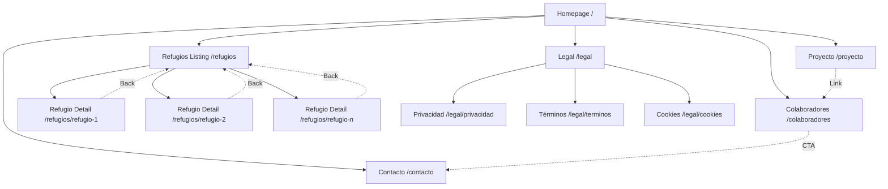
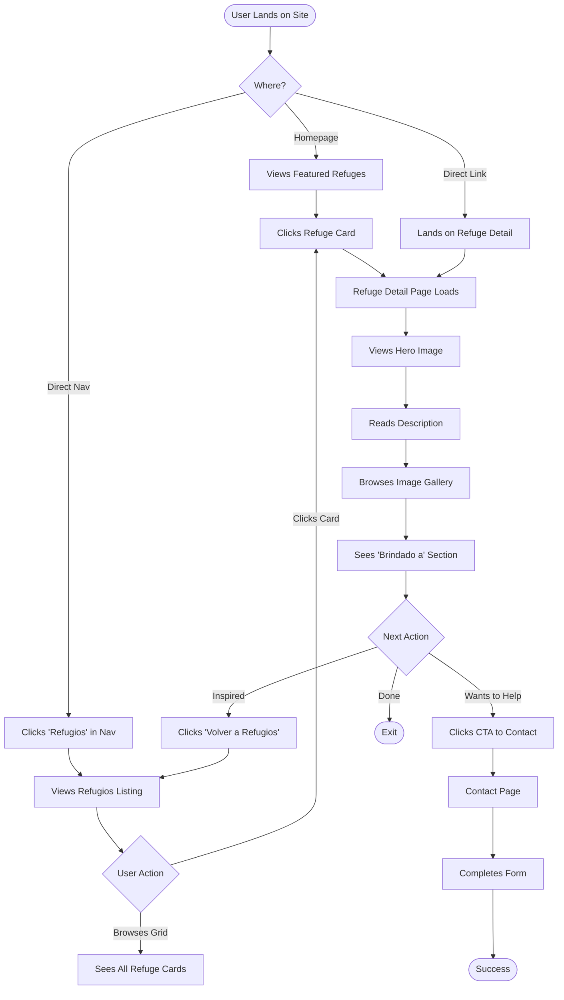
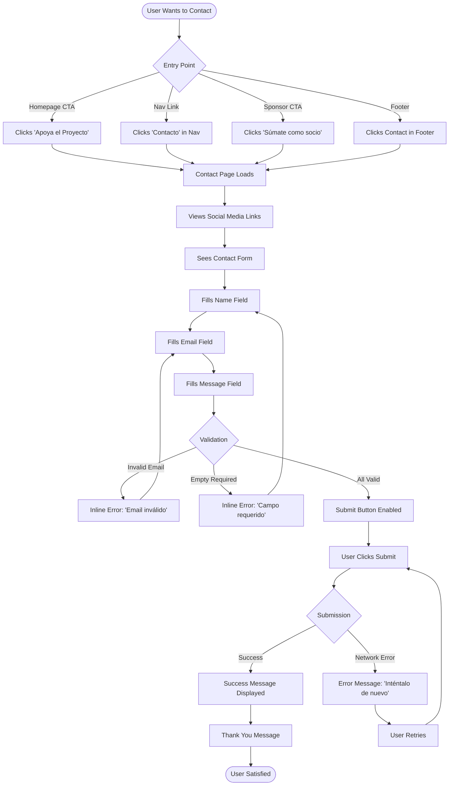
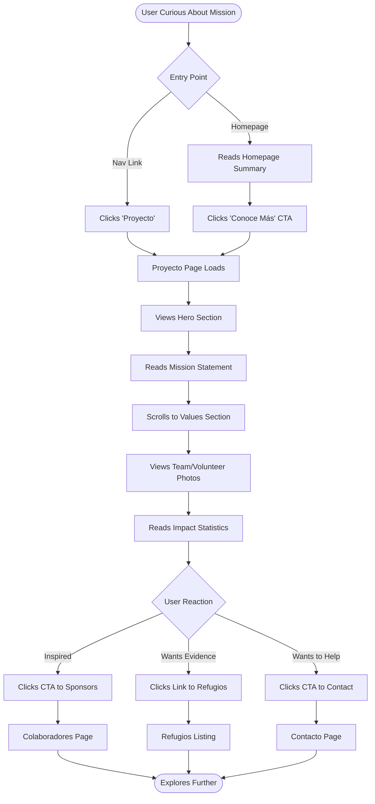
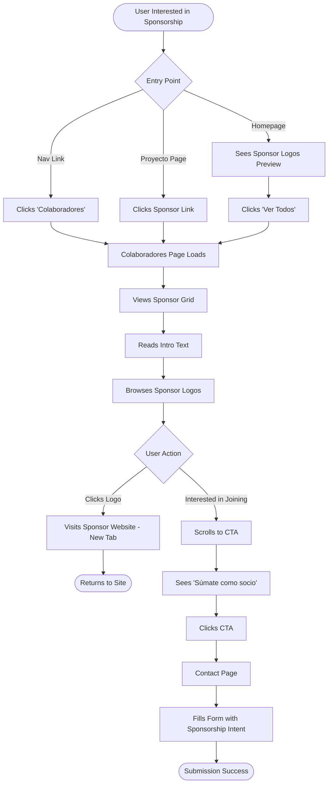

# RefugiosLibresDignos UI/UX Specification

**Version:** 1.0
**Date:** 2025-10-17
**Author:** Sally (UX Expert)
**Status:** Ready for Design & Development

---

## Table of Contents

1. [Introduction](#introduction)
2. [Information Architecture](#information-architecture)
3. [User Flows](#user-flows)
4. [Wireframes & Mockups](#wireframes--mockups)
5. [Component Library](#component-library--design-system)
6. [Branding & Style Guide](#branding--style-guide)
7. [Accessibility Requirements](#accessibility-requirements)
8. [Responsiveness Strategy](#responsiveness-strategy)
9. [Animation & Micro-interactions](#animation--micro-interactions)
10. [Performance Considerations](#performance-considerations)
11. [Next Steps](#next-steps)

---

## Introduction

This document defines the user experience goals, information architecture, user flows, and visual design specifications for RefugiosLibresDignos' user interface. It serves as the foundation for visual design and frontend development, ensuring a cohesive and user-centered experience.

**Project Context:** RefugiosLibresDignos is a non-profit organization dedicated to rehabilitating abandoned mountain refuges in the Pyrenees and providing safe, free, and dignified spaces for people in need. This specification covers **Iteration I (MVP)** - a high-performance static website that showcases the organization's mission, rehabilitated refuges, and enables community engagement.

### Overall UX Goals & Principles

#### Target User Personas

**1. Curious Visitor**
- **Demographics:** General public, ages 25-65, outdoor enthusiasts, socially conscious individuals
- **Goals:** Learn about the organization's mission, discover refuge projects, understand impact
- **Behaviors:** Browses casually, explores visual content, reads mission/values
- **Pain Points:** Needs clear, inspiring content; values quick page loads and mobile access
- **Success Metric:** Spends 2+ minutes on site, views at least 3 refuge stories

**2. Potential Sponsor/Donor**
- **Demographics:** Business owners, corporate social responsibility managers, philanthropists
- **Goals:** Understand organizational credibility, see tangible impact, find ways to contribute
- **Behaviors:** Reviews sponsor list, reads detailed project descriptions, looks for contact methods
- **Pain Points:** Needs transparency, proof of impact, clear call-to-action for partnership
- **Success Metric:** Completes contact form or explores membership information

**3. Community Beneficiary**
- **Demographics:** Individuals or groups who may benefit from free refuge access
- **Goals:** Learn about which refuges are available and who they're dedicated to
- **Behaviors:** Searches for specific refuge information, reads "Brindado a" (dedicated to) sections
- **Pain Points:** Needs accessible, clearly written content; may have limited digital literacy
- **Success Metric:** Successfully finds refuge information and understands access

**4. Media/Press**
- **Demographics:** Journalists, bloggers, documentary filmmakers
- **Goals:** Gather story material, understand organization history, find contact for interviews
- **Behaviors:** Deep dives into project details, downloads images, seeks organizational background
- **Pain Points:** Needs high-quality media assets, clear narratives, responsive communication
- **Success Metric:** Finds compelling stories and successfully contacts organization

#### Usability Goals

1. **Ease of Learning:** New users can navigate to any refuge detail within 30 seconds
2. **Efficiency of Use:** Repeat visitors can find latest refuge updates in 2 clicks or less
3. **Error Prevention:** Contact form provides clear inline validation before submission
4. **Memorability:** Infrequent users recognize navigation patterns immediately upon return
5. **Satisfaction:** Users feel emotionally connected to the mission through storytelling and imagery
6. **Accessibility:** All users, regardless of ability, can access all content (WCAG AA compliance)
7. **Performance:** Pages load in under 2 seconds on 3G connections, creating perception of speed

#### Design Principles

1. **Human Stories First** - Present refuges as human projects serving real communities, not just architectural achievements. Every refuge story should connect to the people it helps.

2. **Nature-Inspired Simplicity** - Clean layouts that echo the tranquility of mountain environments. Avoid clutter, embrace whitespace, let content breathe.

3. **Speed is User Respect** - Every design decision must consider performance impact. Lazy loading, optimized images, minimal JavaScript - speed is a feature, not a bonus.

4. **Accessible by Default** - Accessibility is not an add-on. Design with semantic HTML, proper contrast, keyboard navigation, and screen readers from the start.

5. **Progressive Disclosure** - Show essentials first (refuge card with image/title/status), reveal details on demand (full description on detail page). Don't overwhelm users.

6. **Consistent, Predictable Patterns** - Use familiar UI patterns. Navigation always in same place, CTAs always styled similarly, interactions always feel the same.

7. **Mobile-First, Touch-Friendly** - Design for smallest screens first, enhance for larger viewports. All interactions optimized for touch with generous tap targets.

### Change Log

| Date | Version | Description | Author |
|------|---------|-------------|---------|
| 2025-10-17 | 1.0 | Initial UI/UX specification for Iteration I MVP | Sally (UX Expert) |

---

## Information Architecture (IA)

### Site Map / Screen Inventory



### Navigation Structure

**Primary Navigation (Persistent Header):**
- Fixed position navbar visible on all pages
- Logo (left) - links to homepage
- Main menu items (center/right):
  - Inicio (Home)
  - Proyecto (Project/Mission)
  - Refugios (Refuges)
  - Colaboradores (Sponsors)
  - Contacto (Contact)
- Active page highlighted with accent color (#E78A33)
- Mobile: Hamburger menu (≤768px) with slide-in menu overlay

**Secondary Navigation:**
- **Footer links:** Legal pages (Privacidad, Términos, Cookies), Social media icons
- **Breadcrumbs:** Used on refuge detail pages only
  - Format: `Inicio > Refugios > [Refuge Name]`
  - Provides context and easy navigation back to listing

**Breadcrumb Strategy:**
- Applied to deep pages (2+ levels): Refuge detail pages
- Not used on top-level pages (Home, Proyecto, Refugios listing, Colaboradores, Contacto)
- Always includes "Inicio" as first crumb
- Current page is last crumb, non-clickable, visually distinct
- Separator: `/` or `>` in accent color for visibility

**Navigation Best Practices:**
- Maximum 3 clicks to reach any page
- Navigation order matches user mental model: Mission → Work → Support → Contact
- Skip-to-content link for keyboard users (hidden until focused)
- Clear visual distinction between current page and other nav items

---

## User Flows

### Flow 1: Discover Refuge Projects

**User Goal:** Learn about specific refuge rehabilitation projects

**Entry Points:**
- Homepage featured refuges carousel
- Main navigation "Refugios" link
- Direct URL share (social media, press)

**Success Criteria:**
- User views at least one refuge detail page
- User understands refuge status (planificado, en-obra, finalizado)
- User sees who the refuge is dedicated to ("Brindado a")

#### Flow Diagram



#### Edge Cases & Error Handling

- **No refuges exist:** Display friendly empty state with CTA to check back soon
- **Image fails to load:** Show placeholder with refuge name text overlay
- **Slow connection:** Display image skeleton/placeholder while loading
- **Invalid refuge slug:** Show 404 page with navigation to refuges listing
- **Gallery has only 1 image:** Hide carousel controls, display single image
- **Browser doesn't support Astro Transitions:** Graceful degradation to instant page changes

**Notes:** This is the primary value proposition flow - must be frictionless and visually compelling. Image optimization critical for performance.

---

### Flow 2: Contact Organization

**User Goal:** Reach out to organization with question, interest in sponsorship, or other inquiry

**Entry Points:**
- Homepage CTA ("Apoya el Proyecto")
- Main navigation "Contacto" link
- Colaboradores page CTA ("Súmate como socio")
- Any page footer

**Success Criteria:**
- User successfully submits contact form
- User receives confirmation message
- Form data sent to Formspree/Netlify Forms without errors

#### Flow Diagram



#### Edge Cases & Error Handling

- **No internet connection:** Display clear error: "No hay conexión. Verifica tu red."
- **Formspree service down:** Show fallback email address with mailto: link
- **Bot/spam submission:** Honeypot field catches bots silently
- **User navigates away mid-form:** No data persistence (acceptable for MVP)
- **Form submitted multiple times:** Disable submit button after first click (prevents duplicates)
- **Special characters in message:** Accept all Unicode, sanitize server-side

**Notes:** Form must be accessible, with clear labels and error announcements for screen readers. Consider adding reCAPTCHA if spam becomes an issue.

---

### Flow 3: Explore Organization Mission

**User Goal:** Understand what RefugiosLibresDignos does and why

**Entry Points:**
- Homepage "Proyecto" section CTA
- Main navigation "Proyecto" link
- First-time visitor exploration

**Success Criteria:**
- User reads mission statement
- User sees team/volunteer images
- User understands organizational values

#### Flow Diagram



#### Edge Cases & Error Handling

- **Images fail to load:** Show text-only layout (still functional)
- **Content too long:** Break into scannable sections with headings
- **User skims quickly:** Highlight key points with visual hierarchy

**Notes:** This page establishes trust and credibility. Use authentic photos, clear language, and emotional storytelling.

---

### Flow 4: Review Sponsors and Partnership Opportunities

**User Goal:** See who supports the organization and consider becoming a sponsor

**Entry Points:**
- Homepage sponsor logos preview
- Main navigation "Colaboradores" link
- Proyecto page mention of sponsors

**Success Criteria:**
- User views all sponsor logos
- User understands partnership value
- User contacts organization about sponsorship

#### Flow Diagram



#### Edge Cases & Error Handling

- **No sponsors yet:** Show placeholder with "Sé el primero" message
- **Sponsor logo fails:** Show company name text as fallback
- **External sponsor link broken:** Opens in new tab, user can close and return

**Notes:** Showcase existing sponsors builds credibility for new potential sponsors. Logos should be uniform size and quality.

---

## Wireframes & Mockups

**Primary Design Files:** All detailed visual designs will be created in Figma (to be set up). This section provides conceptual layouts for key screens.

### Key Screen Layouts

#### Homepage (/)

**Purpose:** Welcome users, communicate mission, showcase featured refuges, drive engagement

**Layout Structure:**
```
┌────────────────────────────────────────────┐
│  [Logo]    Inicio Proyecto Refugios ...   │ ← Sticky Navbar
├────────────────────────────────────────────┤
│                                            │
│         [HERO IMAGE - Refuge Photo]        │
│                                            │
│      RefugiosLibresDignos en Pirineos     │ ← H1
│      Espacios seguros, libres y dignos    │ ← Tagline
│                                            │
│         [ Explora Refugios CTA ]           │
│                                            │
├────────────────────────────────────────────┤
│  Nuestro Proyecto                          │ ← H2
│  [2-3 paragraphs + image]                  │
│         [ Conoce Más CTA ]                 │
├────────────────────────────────────────────┤
│  Refugios Destacados                       │ ← H2
│  ┌──────┐  ┌──────┐  ┌──────┐            │
│  │Image │  │Image │  │Image │  ← Carousel │
│  │Title │  │Title │  │Title │            │
│  │Badge │  │Badge │  │Badge │            │
│  └──────┘  └──────┘  └──────┘            │
│         [ Ver Todos CTA ]                  │
├────────────────────────────────────────────┤
│  Nuestros Colaboradores                   │ ← H2
│  [Logo] [Logo] [Logo] [Logo]              │ ← Logo Grid
│  [Logo] [Logo] [Logo] [Logo]              │
│         [ Ver Colaboradores ]             │
├────────────────────────────────────────────┤
│  Apoya el Proyecto                         │ ← Final CTA Section
│  [Brief text about getting involved]       │
│         [ Contáctanos CTA ]                │
├────────────────────────────────────────────┤
│  [Social] [Legal] [Contact] © 2025        │ ← Footer
└────────────────────────────────────────────┘
```

**Key Elements:**
- Hero with full-width background image (optimized, lazy loaded)
- Clear value proposition in H1 + tagline
- Primary CTA button (forest-green background, white text)
- Featured refuges carousel (3-4 items, swipeable)
- Sponsor logo grid (6-8 logos, uniform size)
- Final CTA section with contrasting background (tan/beige)

**Interaction Notes:**
- Hero image uses priority loading (not lazy)
- Carousel auto-advance disabled (user control)
- Smooth scroll to sections on same page
- All CTAs use primary or secondary button styles

**Design File Reference:** [To be created in Figma - Homepage.fig]

---

#### Refugios Listing Page (/refugios)

**Purpose:** Display all refuge rehabilitation projects in browsable grid format

**Layout Structure:**
```
┌────────────────────────────────────────────┐
│  [Logo]    Inicio Proyecto Refugios ...   │ ← Navbar
├────────────────────────────────────────────┤
│                                            │
│         Nuestros Refugios                  │ ← H1
│  Proyectos de rehabilitación en Pirineos  │ ← Subtitle
│                                            │
├────────────────────────────────────────────┤
│  ┌────────┐  ┌────────┐  ┌────────┐      │
│  │ Image  │  │ Image  │  │ Image  │      │ ← Grid (3 col desktop)
│  │ Title  │  │ Title  │  │ Title  │      │
│  │ Badge  │  │ Badge  │  │ Badge  │      │
│  │ Desc   │  │ Desc   │  │ Desc   │      │
│  │[Leer+] │  │[Leer+] │  │[Leer+] │      │
│  └────────┘  └────────┘  └────────┘      │
│                                            │
│  ┌────────┐  ┌────────┐  ┌────────┐      │
│  │ Image  │  │ Image  │  │ Image  │      │
│  │ ...    │  │ ...    │  │ ...    │      │
│  └────────┘  └────────┘  └────────┘      │
│                                            │
├────────────────────────────────────────────┤
│  [Footer]                                  │
└────────────────────────────────────────────┘
```

**Key Elements:**
- Page title (H1) with descriptive subtitle
- Responsive grid: 3 columns (desktop), 2 columns (tablet), 1 column (mobile)
- Refuge cards with:
  - Image (aspect ratio 3:2)
  - Title (H3)
  - Status badge (color-coded: green/yellow/gray)
  - Short description (3 lines max, truncated)
  - "Leer más" link (sunrise-orange color)
- Cards have hover effect: subtle elevation/shadow + scale
- Images lazy loaded (except first 3 above fold)

**Interaction Notes:**
- Cards are clickable areas linking to refuge detail
- Status badge has aria-label for screen readers
- Grid adapts smoothly across breakpoints
- Empty state (no refuges): "Pronto tendremos refugios aquí"

**Design File Reference:** [To be created in Figma - Refugios.fig]

---

#### Refuge Detail Page (/refugios/[slug])

**Purpose:** Showcase individual refuge project with full details and image gallery

**Layout Structure:**
```
┌────────────────────────────────────────────┐
│  [Logo]    Inicio Proyecto Refugios ...   │ ← Navbar
├────────────────────────────────────────────┤
│  Inicio > Refugios > Refugio Name         │ ← Breadcrumbs
├────────────────────────────────────────────┤
│                                            │
│         Refugio de [Name]        [Badge]  │ ← H1 + Status
│                                            │
│  ┌────────────────────────────────────┐   │
│  │                                    │   │
│  │       [MAIN IMAGE - Gallery]       │   │ ← Image Carousel
│  │                                    │   │
│  │        ◄  [1/5]  ►                │   │ ← Controls
│  └────────────────────────────────────┘   │
│          ● ● ● ○ ○                        │ ← Dots Indicator
│                                            │
├────────────────────────────────────────────┤
│  Short Description (Highlighted)           │ ← Lead paragraph
│                                            │
│  Long Description (Markdown formatted)     │ ← Article content
│  Multiple paragraphs with rich formatting  │
│                                            │
├────────────────────────────────────────────┤
│  Brindado a                                │ ← H2
│  ┌────────────────────────────────────┐   │
│  │ [Icon] Who this refuge serves      │   │ ← Info box (tan bg)
│  │ Description of beneficiary group    │   │
│  └────────────────────────────────────┘   │
├────────────────────────────────────────────┤
│         ← Volver a Refugios                │ ← Back link
├────────────────────────────────────────────┤
│  [Footer]                                  │
└────────────────────────────────────────────┘
```

**Key Elements:**
- Breadcrumb navigation for context
- Refuge title (H1) with status badge inline
- Image carousel/gallery:
  - Full-width hero image
  - Previous/Next arrows
  - Dot indicators (current image highlighted)
  - Swipe gestures on touch devices
  - Keyboard navigation (arrow keys)
- Short description emphasized (larger font, bold)
- Long description with proper typography (prose styles)
- "Brindado a" section with distinct background (tan/beige)
- Back link to refugios listing

**Interaction Notes:**
- Hero image loads with priority (not lazy)
- Gallery images lazy loaded
- Carousel accessible with ARIA labels and live region
- Smooth transitions between images (300ms fade)
- Optional: Lightbox for full-screen image view (can defer to future iteration)

**Design File Reference:** [To be created in Figma - RefugioDetail.fig]

---

#### Contact Page (/contacto)

**Purpose:** Provide multiple ways to contact organization, with focus on contact form

**Layout Structure:**
```
┌────────────────────────────────────────────┐
│  [Logo]    Inicio Proyecto Refugios ...   │ ← Navbar
├────────────────────────────────────────────┤
│                                            │
│         Contacta con Nosotros              │ ← H1
│                                            │
│  ┌──────────────┐  ┌──────────────────┐   │
│  │ Social Media │  │  Contact Form    │   │ ← 2-column layout
│  │              │  │                  │   │    (stacks on mobile)
│  │ [Facebook]   │  │ Nombre: [____]   │   │
│  │ [Instagram]  │  │                  │   │
│  │ [Twitter]    │  │ Email: [______]  │   │
│  │              │  │                  │   │
│  │ Email:       │  │ Mensaje:         │   │
│  │ info@...     │  │ [___________]    │   │
│  │              │  │ [___________]    │   │
│  └──────────────┘  │ [___________]    │   │
│                    │                  │   │
│                    │ [Enviar Mensaje] │   │
│                    └──────────────────┘   │
│                                            │
├────────────────────────────────────────────┤
│  [Footer]                                  │
└────────────────────────────────────────────┘
```

**Key Elements:**
- Clear page title (H1)
- Two-column layout (desktop), stacks vertically (mobile)
- **Left column:** Social media links with icons, organization email
- **Right column:** Contact form with:
  - Name field (required)
  - Email field (required, validated)
  - Message field (required, textarea, 6 rows)
  - Submit button (primary style)
  - Honeypot field (hidden, for spam prevention)
- Form labels clearly associated with inputs
- Inline validation with error messages
- Success message displayed below form after submission

**Interaction Notes:**
- Social links open in new tab (rel="noopener noreferrer")
- Form validates on blur and on submit
- Email validated with regex pattern
- Submit button disabled while submitting (prevents double-submit)
- Success: "¡Gracias! Tu mensaje ha sido enviado."
- Error: "Error al enviar. Inténtalo de nuevo."
- All form fields keyboard navigable with visible focus states

**Design File Reference:** [To be created in Figma - Contacto.fig]

---

#### Colaboradores Page (/colaboradores)

**Purpose:** Showcase current sponsors and encourage new sponsorships

**Layout Structure:**
```
┌────────────────────────────────────────────┐
│  [Logo]    Inicio Proyecto Refugios ...   │ ← Navbar
├────────────────────────────────────────────┤
│                                            │
│         Nuestros Colaboradores            │ ← H1
│  Gracias a quienes hacen posible este...  │ ← Subtitle (2-3 lines)
│                                            │
├────────────────────────────────────────────┤
│  Empresas                                  │ ← H2
│  ┌──────┐  ┌──────┐  ┌──────┐  ┌──────┐  │
│  │ Logo │  │ Logo │  │ Logo │  │ Logo │  │ ← Logo Grid
│  └──────┘  └──────┘  └──────┘  └──────┘  │    (4 cols desktop)
│  ┌──────┐  ┌──────┐                       │
│  │ Logo │  │ Logo │                       │
│  └──────┘  └──────┘                       │
├────────────────────────────────────────────┤
│  Instituciones                             │ ← H2
│  ┌──────┐  ┌──────┐  ┌──────┐            │
│  │ Logo │  │ Logo │  │ Logo │            │
│  └──────┘  └──────┘  └──────┘            │
├────────────────────────────────────────────┤
│  ¿Quieres sumarte?                         │ ← CTA Section
│  [Brief text about becoming sponsor]       │
│         [ Contáctanos CTA ]                │
├────────────────────────────────────────────┤
│  [Footer]                                  │
└────────────────────────────────────────────┘
```

**Key Elements:**
- Introductory text thanking sponsors
- Sponsor categories (Empresas, Instituciones, Particulares if applicable)
- Logo grid: 4 columns (desktop), 2 columns (tablet), 1 column (mobile)
- Logos uniform size, high contrast, professional presentation
- Logos clickable, linking to sponsor websites (new tab)
- Hover effect on logos (subtle scale/opacity)
- CTA section with contrasting background
- Primary button "Contáctanos" linking to contact page

**Interaction Notes:**
- Logos optimized as PNG/SVG for quality
- Alt text for each logo (company name)
- Empty state per category if no sponsors: "Pronto aquí"
- Smooth grid reflow across breakpoints

**Design File Reference:** [To be created in Figma - Colaboradores.fig]

---

#### Proyecto Page (/proyecto)

**Purpose:** Explain organization mission, values, team, and impact

**Layout Structure:**
```
┌────────────────────────────────────────────┐
│  [Logo]    Inicio Proyecto Refugios ...   │ ← Navbar
├────────────────────────────────────────────┤
│         [HERO IMAGE - Volunteers]          │
│         Nuestro Proyecto                   │ ← H1 over image
├────────────────────────────────────────────┤
│  Nuestra Misión                            │ ← H2
│  [2-3 paragraphs explaining mission]       │
│                                            │
│  ┌─────────────┐  [Image: Mountain work]  │ ← Image + Text
│  │             │                           │
│  └─────────────┘                           │
├────────────────────────────────────────────┤
│  Nuestros Valores                          │ ← H2
│  ┌────────┐  ┌────────┐  ┌────────┐      │
│  │ [Icon] │  │ [Icon] │  │ [Icon] │      │ ← 3-column cards
│  │ Valor1 │  │ Valor2 │  │ Valor3 │      │
│  │ Text   │  │ Text   │  │ Text   │      │
│  └────────┘  └────────┘  └────────┘      │
├────────────────────────────────────────────┤
│  Nuestro Impacto                           │ ← H2
│  [Statistics or achievements]              │
│  • 5 refugios rehabilitados               │
│  • 200+ personas beneficiadas             │
│  • 3 años de trabajo                      │
├────────────────────────────────────────────┤
│  Equipo                                    │ ← H2
│  [Team photos with names/roles]            │
│  (Optional: Defer to future iteration)     │
├────────────────────────────────────────────┤
│  Conoce a Nuestros Colaboradores          │ ← CTA Section
│         [ Ver Colaboradores ]             │
├────────────────────────────────────────────┤
│  [Footer]                                  │
└────────────────────────────────────────────┘
```

**Key Elements:**
- Hero image with text overlay (mission-focused)
- Mission section with paragraph text
- Values section with icon cards (3 columns)
- Impact statistics (bullet list or visual stats)
- Optional team section (can defer to future)
- CTA to Colaboradores page

**Interaction Notes:**
- Hero image priority loaded
- Values cards have icons (can use emoji or SVG)
- Smooth scrolling between sections
- Responsive layout: cards stack on mobile

**Design File Reference:** [To be created in Figma - Proyecto.fig]

---

## Component Library / Design System

**Design System Approach:** Custom design system built with TailwindCSS, following Astro component patterns. No external UI library (Material, Ant Design) used to maintain performance and brand uniqueness.

### Core Components

#### Button Component

**Purpose:** Primary interactive element for CTAs and form submissions

**Variants:**
- **Primary:** Solid background (forest-green), white text
- **Secondary:** Outlined border (sunrise-orange), colored text
- **Disabled:** Grayed out, not clickable

**States:**
- **Default:** Base styling
- **Hover:** Background color shifts (primary: lime-green, secondary: fills with sunrise-orange)
- **Focus:** 2px solid outline in sunrise-orange
- **Active:** Slightly darker background
- **Disabled:** Reduced opacity, cursor not-allowed

**Usage Guidelines:**
- Use primary buttons for main actions (Enviar, Explora, Contáctanos)
- Use secondary buttons for less critical actions (Ver Más, Volver)
- Maximum 1 primary button per screen section
- Button text should be action-oriented verbs
- Minimum touch target: 44x44px

**Technical Specs:**
```css
.btn-primary {
  background: #284c3e;
  color: #FFFFFF;
  border-radius: 4px;
  padding: 12px 24px;
  transition: all 0.3s ease;
}

.btn-primary:hover {
  background: #648D21;
}
```

---

#### Refuge Card Component

**Purpose:** Display refuge summary in listings and carousels

**Variants:**
- **Standard:** Normal card display
- **Featured:** Border accent (sunrise-orange) to highlight

**States:**
- **Default:** Card with subtle shadow
- **Hover:** Elevated shadow, slight scale (1.05x), image zoom
- **Focus:** Outline visible (2px sunrise-orange)

**Usage Guidelines:**
- Always include image, title, status badge, short description
- Status badge color-coded: green (finalizado), yellow (en-obra), gray (planificado)
- Keep descriptions to 3 lines max (use line-clamp)
- Image aspect ratio consistent (3:2)

**Technical Specs:**
- Image: 600x400px (responsive)
- Title: H3 (24px, forest-green, weight 600)
- Description: 16px, 3 line clamp
- Card padding: 16px
- Border-radius: 8px

---

#### Carousel/Gallery Component

**Purpose:** Display multiple images with navigation controls

**Variants:**
- **Standard:** Multi-image carousel (refuge detail page)
- **Featured:** Homepage featured refuges carousel

**States:**
- **Active slide:** Visible, full opacity
- **Inactive slides:** Hidden or low opacity
- **Navigation controls:** Visible on hover (desktop), always visible (mobile/touch)

**Usage Guidelines:**
- Always include Previous/Next arrows
- Include dot indicators showing current position
- Support swipe gestures on touch devices
- Keyboard accessible (arrow keys, tab navigation)
- ARIA live region announces current slide to screen readers
- Auto-advance disabled by default (user control)

**Technical Specs:**
- Transition duration: 300ms
- Easing: ease-in-out
- Arrows: 44x44px minimum touch target
- Dots: 12px diameter, 8px spacing

---

#### Navigation Bar Component

**Purpose:** Persistent navigation across all pages

**Variants:**
- **Desktop:** Horizontal menu, all items visible
- **Mobile:** Hamburger menu with slide-in overlay

**States:**
- **Default:** Fixed position at top
- **Active page:** Highlighted (sunrise-orange text, bold weight)
- **Hover:** Color change to lime-green
- **Mobile menu open:** Full-screen overlay with vertical menu

**Usage Guidelines:**
- Logo always links to homepage
- Menu items in order: Inicio, Proyecto, Refugios, Colaboradores, Contacto
- Active page clearly indicated
- Skip-to-content link for keyboard users (hidden until focused)

**Technical Specs:**
- Height: 64px (desktop), 56px (mobile)
- Background: forest-green (#284c3e)
- Text: white
- Logo max-height: 48px
- Hamburger icon: 24x24px, 3 bars

---

#### Footer Component

**Purpose:** Provide secondary navigation and legal links

**Variants:** Single variant (consistent across all pages)

**States:** Static (no interactive states on container)

**Usage Guidelines:**
- Include legal links (Privacidad, Términos, Cookies)
- Include social media icons with links
- Display copyright notice with current year
- Optional: Organization email

**Technical Specs:**
- Background: tan (#D8C28E)
- Text: forest-green
- Padding: 32px vertical
- Layout: Multi-column (desktop), stacked (mobile)

---

#### Form Input Component

**Purpose:** Text input fields for contact form

**Variants:**
- **Text input:** Single-line (name, email)
- **Textarea:** Multi-line (message)

**States:**
- **Default:** Border (neutral gray)
- **Focus:** Border changes to sunrise-orange, 2px outline
- **Error:** Red border, error message below
- **Valid:** Subtle green accent (optional)
- **Disabled:** Grayed out, not editable

**Usage Guidelines:**
- Always pair with visible `<label>`
- Include placeholder text (not as label replacement)
- Validate on blur and on submit
- Show error messages inline, below field
- Error messages announced to screen readers

**Technical Specs:**
- Height: 48px (input), auto (textarea)
- Border: 1px solid #f7f4ef
- Border-radius: 4px
- Padding: 12px 16px
- Focus outline: 2px #E78A33

---

#### Status Badge Component

**Purpose:** Indicate refuge project status

**Variants:**
- **Finalizado:** Green background, white text
- **En-obra:** Orange background, white text
- **Planificado:** Gray background, dark text

**States:** Static (no interactive states)

**Usage Guidelines:**
- Always include on refuge cards and detail pages
- Color-coded for quick visual scanning
- Include aria-label for screen readers

**Technical Specs:**
- Padding: 4px 12px
- Border-radius: 999px (pill shape)
- Font-size: 12px
- Font-weight: 600

---

## Branding & Style Guide

**Brand Guidelines:** RefugiosLibresDignos custom brand identity

### Visual Identity

The visual identity evokes the natural beauty of the Pyrenees mountains while maintaining a modern, professional appearance. The color palette draws from nature (forest greens, sunrise oranges, earth tones), creating a warm, welcoming feel that emphasizes the human impact of the organization's work.

### Color Palette

| Color Type | Hex Code | Usage |
|------------|----------|-------|
| **Primary** | #284c3e (Forest Green) | Headers, main text, navbar background, primary buttons/CTAs - evokes nature, stability, trust |
| **Accent 1** | #E78A33 (Sunrise Orange) | Secondary buttons, hover states, focus indicators, links - adds energy and attention |
| **Accent 2** | #648D21 (Lime Green) | Icons, labels, H3 headings, button hover - provides freshness and vitality |
| **Base** | #FFFFFF (Pure White) | Main background, content areas, card backgrounds - clean and modern |
| **Background Dark** | #f7f4ef (Off-White) | Subtitles, borders, dividers, secondary text - softens contrasts |
| **Background Light** | #f9f8f4 (Light Warm) | Alternative section backgrounds, subtle content areas - very light warm tone |
| **Neutral Warm** | #D8C28E (Tan/Beige) | Card backgrounds, testimonials, footer, section alternation - warm and welcoming |
| **Success** | #648D21 (Lime Green) | Success messages, positive feedback, "finalizado" badge |
| **Warning** | #E78A33 (Sunrise Orange) | Important notices, "en-obra" badge |
| **Error** | #D32F2F (Red) | Error messages, validation errors, destructive actions |

**Color Accessibility:**
- All text/background combinations meet WCAG AA contrast requirements (4.5:1 minimum)
- Forest Green on White: 6.8:1 (Pass)
- Sunrise Orange on White: 3.8:1 (Pass for large text only)
- White on Forest Green: 6.8:1 (Pass)

---

### Typography

#### Font Families

- **Primary:** Inter (sans-serif), loaded locally from `/public/fonts/`
- **Secondary:** N/A (single font family for consistency)
- **Monospace:** System default (for code, if needed in future)

#### Type Scale

| Element | Size | Weight | Line Height | Use Case |
|---------|------|--------|-------------|----------|
| **H1** | 40-48px | 700 (Bold) | 1.2 | Page titles, hero headings |
| **H2** | 32px | 600 (SemiBold) | 1.3 | Section headings |
| **H3** | 24px | 600 (SemiBold) | 1.4 | Subsection headings, card titles |
| **Body** | 18px | 400 (Regular) | 1.6 | Main content paragraphs |
| **Body Small** | 16px | 400 (Regular) | 1.6 | Secondary content, captions |
| **Small** | 14px | 400 (Regular) | 1.5 | Footer text, meta information |
| **Button** | 16px | 600 (SemiBold) | 1.5 | Button labels, CTAs |

**Responsive Typography:**
- H1: 40px (mobile) → 48px (desktop)
- H2: 28px (mobile) → 32px (desktop)
- H3: 20px (mobile) → 24px (desktop)
- Body: 16px (mobile) → 18px (desktop)

---

#### Iconography

**Icon Library:** No icon library needed for Iteration I. Use Unicode symbols (emoji) or inline SVG for simple icons.

**Usage Guidelines:**
- Social media icons: SVG format, monochrome, 24x24px
- Status indicators: Color-coded badges (text only, no icon needed)
- Navigation: Text-only for MVP (no hamburger icon library dependency)
- Future: Consider Heroicons or Lucide for consistency if more icons needed

---

#### Spacing & Layout

**Grid System:**
- **Desktop:** 12-column grid, max-width 1280px, 24px gutters
- **Tablet:** 8-column grid, 16px gutters
- **Mobile:** Single column, 16px side margins

**Spacing Scale:** (based on 4px increments)
- **xs:** 4px - Tiny gaps, icon spacing
- **sm:** 8px - Tight spacing, list items
- **md:** 16px - Default spacing, card padding
- **lg:** 24px - Section spacing, component gaps
- **xl:** 32px - Large gaps between sections
- **2xl:** 48px - Hero spacing, major section breaks
- **3xl:** 64px - Page-level vertical spacing

**Container:**
- Max-width: 1280px
- Padding: 16px (mobile), 32px (desktop)
- Centered with `margin: 0 auto`

---

## Accessibility Requirements

### Compliance Target

**Standard:** WCAG 2.1 Level AA compliance (mandatory)

RefugiosLibresDignos is committed to creating an inclusive experience for all users, regardless of ability. All design and development decisions must prioritize accessibility from the start, not as an afterthought.

### Key Requirements

**Visual:**
- **Color contrast ratios:** Minimum 4.5:1 for normal text, 3:1 for large text (18px+)
  - Tested with WebAIM Contrast Checker
  - All text/background combinations validated
- **Focus indicators:** Visible 2px solid outline (#E78A33) on all interactive elements
  - Never remove default focus styles without providing alternatives
  - Focus indicators must have 3:1 contrast against background
- **Text sizing:** Minimum 16px for body text, supports browser zoom up to 200% without horizontal scrolling
  - Use relative units (rem, em) not pixels for font sizes
  - Test at 200% zoom on various devices

**Interaction:**
- **Keyboard navigation:** All functionality accessible via keyboard alone
  - Tab order follows logical reading order
  - Skip-to-content link visible on first Tab press
  - Carousel controls accessible with Tab and arrow keys
  - Form fields navigable with Tab, submittable with Enter
- **Screen reader support:** Semantic HTML, ARIA labels where needed
  - Headings properly nested (H1 → H2 → H3, no skips)
  - Images have descriptive alt text (not "image of...")
  - Form labels associated with inputs (for/id attributes)
  - ARIA live regions for dynamic content (carousel position, form success/error)
  - Landmarks (nav, main, footer) properly used
- **Touch targets:** Minimum 44x44px for all clickable elements
  - Buttons, links, carousel controls, form inputs
  - Adequate spacing between touch targets (8px minimum)

**Content:**
- **Alternative text:** All images have descriptive alt attributes
  - Decorative images: alt="" (empty alt)
  - Informational images: Describe content, not appearance
  - Refuge images: "Refugio [Name] en [Location]"
- **Heading structure:** Proper hierarchy, only one H1 per page
  - H1: Page title
  - H2: Major sections
  - H3: Subsections, card titles
  - No skipping levels (H1 → H3)
- **Form labels:** Every input has associated visible label
  - Labels use `<label for="input-id">`, not placeholder text
  - Required fields indicated with * and "(requerido)" text
  - Error messages linked to fields with aria-describedby

### Testing Strategy

**Automated Testing:**
- Axe DevTools browser extension on every page
- Lighthouse accessibility audit (target: 100 score)
- WAVE browser extension for visual feedback
- Pa11y CI integrated into GitHub Actions (future)

**Manual Testing:**
- **Keyboard navigation:** Test all interactions without mouse
  - Can all pages be navigated with Tab/Shift+Tab?
  - Can all actions be completed with keyboard only?
  - Are focus indicators always visible?
- **Screen reader testing:** NVDA (Windows), JAWS (Windows), VoiceOver (macOS/iOS)
  - Do headings make sense out of context?
  - Are images described appropriately?
  - Are form errors announced clearly?
  - Does carousel position get announced?
- **Zoom testing:** Test at 200% browser zoom
  - No horizontal scrolling required
  - All content remains readable and functional
  - No overlapping elements
- **Color blindness simulation:** Chrome DevTools vision deficiency emulation
  - Can status badges be distinguished by shape/text, not just color?
  - Are form errors indicated by icons/text, not just color?

**Testing Schedule:**
- Every PR: Automated Axe and Lighthouse checks
- Every new component: Manual keyboard and screen reader testing
- Before each deployment: Full accessibility audit
- Quarterly: Comprehensive review with real users

**Accessibility Statement:** (To be published on /legal/accesibilidad page)
- Commitment to WCAG AA compliance
- Known issues and workarounds (if any)
- Contact method for reporting accessibility barriers
- Timeline for addressing reported issues (target: 7 days)

---

## Responsiveness Strategy

### Breakpoints

| Breakpoint | Min Width | Max Width | Target Devices |
|------------|-----------|-----------|----------------|
| **Mobile** | 320px | 767px | Smartphones (portrait and landscape) |
| **Tablet** | 768px | 1023px | Tablets, small laptops |
| **Desktop** | 1024px | 1919px | Laptops, desktop monitors |
| **Wide** | 1920px | - | Large desktop monitors, 4K displays |

**Tailwind Breakpoint Mapping:**
- Mobile: Default (no prefix)
- Tablet: `md:` (768px+)
- Desktop: `lg:` (1024px+)
- Wide: `xl:` (1280px+)

### Adaptation Patterns

**Layout Changes:**
- **Mobile (320-767px):**
  - Single column layouts
  - Stacked navigation (hamburger menu)
  - Full-width cards
  - Reduced padding/margins (16px sides)
  - Smaller type scale (H1: 40px)
- **Tablet (768-1023px):**
  - 2-column grids for refuge cards
  - Hybrid navigation (visible nav items, possible collapse)
  - Moderate padding (24px sides)
  - Medium type scale (H1: 44px)
- **Desktop (1024px+):**
  - 3-column grids for refuge cards
  - Full horizontal navigation
  - 4-column logo grids
  - Maximum padding (32px sides)
  - Full type scale (H1: 48px)
- **Wide (1920px+):**
  - Max-width container (1280px) to prevent excessive line lengths
  - More generous whitespace
  - Potential for 4-column refuge grid

**Navigation Changes:**
- **Mobile:** Hamburger icon → slide-in menu (full-screen overlay)
- **Tablet:** Horizontal nav may collapse to hamburger depending on logo size
- **Desktop:** Full horizontal navigation, all items visible

**Content Priority:**
- **Mobile-first approach:** Essential content shown first
  - Hero image + headline
  - Primary CTA
  - Featured refuges (1-2 visible)
  - Truncated descriptions
- **Desktop enhancement:** More context, richer visuals
  - Full descriptions
  - More refuge cards visible (3-4)
  - Sidebar content (if applicable)

**Interaction Changes:**
- **Mobile:**
  - Touch-optimized (swipe for carousel)
  - Larger tap targets (44x44px minimum)
  - Simplified interactions
  - Bottom-aligned CTAs for thumb reach
- **Desktop:**
  - Mouse hover states
  - Keyboard shortcuts
  - More complex interactions (hover previews)

### Responsive Images

**Strategy:** Use Astro's `<Image>` component with responsive srcset

**Implementation:**
```html
<Image
  src={refugio.image}
  alt={refugio.alt}
  widths={[320, 640, 960, 1280]}
  sizes="(max-width: 767px) 100vw, (max-width: 1023px) 50vw, 33vw"
  format="webp"
  loading="lazy"
/>
```

**Formats:**
- AVIF (modern browsers)
- WebP (fallback)
- JPEG (legacy fallback)

---

## Animation & Micro-interactions

### Motion Principles

1. **Purposeful, Not Decorative:** Every animation must serve a purpose (feedback, guidance, delight). Avoid animation for animation's sake.

2. **Fast and Subtle:** Animations should feel instant (100-300ms). Users should barely notice the motion, but feel the smoothness.

3. **Respects User Preferences:** Honor `prefers-reduced-motion` media query. Disable or simplify animations for users who prefer reduced motion.

4. **Performance-First:** Use CSS transforms (translate, scale, opacity) not properties that trigger layout (width, height, top, left).

5. **Consistent Easing:** Use consistent easing functions across all animations:
   - **Standard:** `ease-in-out` for most transitions
   - **Entrance:** `ease-out` for elements appearing
   - **Exit:** `ease-in` for elements disappearing

### Key Animations

- **Page Transitions:** Subtle fade (200ms, ease-in-out) using Astro Transitions
  - Respects `prefers-reduced-motion` (instant change if preferred)

- **Button Hover:** Background color shift (300ms, ease)
  - Primary: #27582E → #648D21
  - Secondary: transparent → #E78A33 fill

- **Card Hover:** Elevation + scale (300ms, ease-out)
  - Scale: 1.0 → 1.05
  - Shadow: subtle → elevated

- **Carousel Transition:** Image fade (300ms, ease-in-out)
  - Old image fades out, new image fades in
  - No slide/swipe animation (performance concern)

- **Form Focus:** Border color + outline (150ms, ease)
  - Border: gray → sunrise-orange
  - Outline: 2px solid

- **Mobile Menu:** Slide-in overlay (250ms, ease-out)
  - Transform: translateX(-100%) → translateX(0)
  - Backdrop fade: opacity 0 → 0.5

- **Scroll Reveal:** Fade-in for sections (Optional, can defer)
  - Opacity: 0 → 1 (400ms, ease-out) when section enters viewport
  - Only on desktop (disabled on mobile for performance)

- **Loading State:** Skeleton/pulse animation (Optional)
  - Subtle opacity pulse while images load
  - Duration: 1.5s infinite

### Reduced Motion Support

```css
@media (prefers-reduced-motion: reduce) {
  * {
    animation-duration: 0.01ms !important;
    animation-iteration-count: 1 !important;
    transition-duration: 0.01ms !important;
  }
}
```

All animations respect user preference for reduced motion.

---

## Performance Considerations

### Performance Goals

- **Page Load:** First Contentful Paint (FCP) < 1.5s on 3G
- **Interaction Response:** Button clicks respond in < 100ms
- **Animation FPS:** 60fps (16.67ms per frame) for all animations
- **Lighthouse Score:** ≥95 desktop, ≥90 mobile
- **Total Blocking Time:** < 150ms
- **Cumulative Layout Shift:** < 0.1

### Design Strategies

**Image Optimization:**
- Use `astro:assets` for automatic optimization
- Lazy load all images except hero/above-fold
- Serve AVIF/WebP with JPEG fallback
- Explicit width/height to prevent CLS
- Responsive srcset for different viewport sizes
- Compress images at build time (target: <200KB per image)

**Font Loading:**
- Self-host Inter font (avoid external requests)
- Preload critical font weights (400, 600, 700)
- Use `font-display: swap` to prevent FOIT (Flash of Invisible Text)
- Subset fonts to include only Latin characters (reduce file size)

**CSS Optimization:**
- TailwindCSS with aggressive purging (removes unused styles)
- Critical CSS inlined in `<head>` for above-fold content
- Non-critical CSS deferred
- Total CSS bundle target: <50KB minified

**JavaScript Minimization:**
- Zero JavaScript by default (Astro SSG)
- Only add JS for interactive components (carousel, mobile menu, form validation)
- Use `client:visible` or `client:idle` directives (not `client:load`)
- Total JS bundle target: <200KB
- Defer non-critical scripts

**Layout Stability:**
- Reserve space for images with width/height attributes
- Avoid injecting content above existing content
- Use CSS aspect-ratio for responsive images
- Skeleton loaders for async content (if needed)

**Third-Party Scripts:**
- Minimize external dependencies
- Formspree form submission (necessary)
- No Google Fonts (self-hosted)
- No analytics in Iteration I (defer to Iteration II)
- No social media embeds (just links)

**Caching Strategy:**
- Static assets cached for 1 year (immutable, content-hashed filenames)
- HTML not cached (always fresh from CDN)
- Vercel edge caching for global distribution

**Monitoring:**
- Lighthouse CI on every PR
- Real User Monitoring (future: add Plausible or similar)
- Core Web Vitals tracked in Google Search Console

---

## Next Steps

### Immediate Actions

1. **Create Figma workspace** for detailed visual designs
   - Set up design file with frames for each key screen
   - Import color palette and typography specifications
   - Create component library in Figma matching this spec

2. **Gather content from client**
   - Refuge photos (high-resolution, minimum 1920x1280px)
   - Organization mission statement and values text
   - Team/volunteer photos (if including in Iteration I)
   - Sponsor logos (vector format preferred: SVG, PNG)
   - Legal text (privacy policy, terms, cookie policy)

3. **Set up visual design system**
   - Download and prepare Inter font files (woff2 format)
   - Create color swatches in design tool
   - Prepare icon set (social media, UI controls)

4. **Review with stakeholders**
   - Present this UX spec to organization leadership
   - Validate user personas and flows
   - Confirm content priorities and messaging
   - Get approval on branding and color choices

5. **Prepare for development handoff**
   - Share this document with architect/developer
   - Ensure all technical requirements documented in Frontend Architecture
   - Establish workflow for design → development collaboration

### Design Handoff Checklist

- [x] All user flows documented
- [x] Component inventory complete
- [x] Accessibility requirements defined
- [x] Responsive strategy clear
- [x] Brand guidelines incorporated
- [x] Performance goals established
- [ ] Figma designs created for all key screens
- [ ] Design components mapped to technical components
- [ ] Content strategy defined with client
- [ ] Asset library prepared (images, logos, fonts)
- [ ] Stakeholder approval obtained
- [ ] Developer questions addressed

### Collaboration with Development

**Design-Dev Workflow:**
1. UX creates wireframes/mockups in Figma
2. Developer implements components in Astro
3. UX reviews implementation for design fidelity
4. Joint testing for accessibility and responsiveness
5. Iterative refinement based on feedback

**Communication Cadence:**
- Daily: Quick sync on progress/blockers (async via chat)
- Weekly: Design review session (30-60min)
- Per-story: Acceptance criteria review before development

**Tools:**
- Figma for design collaboration
- GitHub for technical implementation
- Shared design system documentation (this document)

---

## Checklist Results

_(This section will be populated when UX checklist is run against this document)_

**Current Status:** UX Specification complete and ready for visual design phase.

**Recommended Next Step:** Create detailed Figma mockups for Homepage, Refugios listing, and Refuge detail pages based on this specification.

---

**End of UI/UX Specification Document**

---

**Document Status:** ✅ Ready for Visual Design
**Last Updated:** 2025-10-17
**Maintained By:** Sally (UX Expert)

**Related Documents:**
- [PRD](docs/prd.md) - Product requirements and user stories
- [Frontend Architecture](docs/ui-architecture.md) - Technical implementation specifications
- [Project Brief](docs/Project%20brief.md) - Original project specifications

---

### Appendix: Design Resources

**Design Tools:**
- Figma (recommended for collaborative design)
- Sketch (alternative)
- Adobe XD (alternative)

**Accessibility Testing Tools:**
- Axe DevTools (browser extension)
- WAVE (browser extension)
- Lighthouse (Chrome DevTools)
- NVDA (Windows screen reader)
- VoiceOver (macOS/iOS screen reader)

**Color Contrast Checkers:**
- WebAIM Contrast Checker
- Colorable
- Stark (Figma plugin)

**Typography Resources:**
- Inter Font: https://fonts.google.com/specimen/Inter
- Type Scale Calculator: https://type-scale.com/

**Inspiration:**
- Non-profit website examples showcasing impact stories
- Mountain photography portfolios
- Clean, minimalist web design patterns
